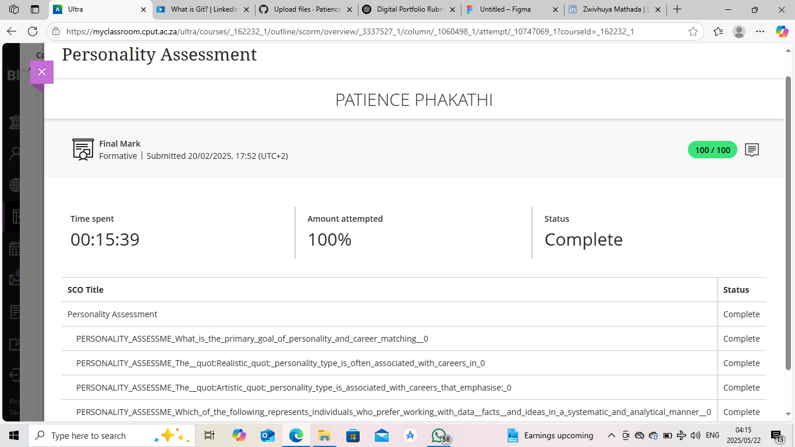

# Personality Assessment

---

## ✅ Evidence

As part of the Work Readiness Training, I completed a personality assessment to better understand how my personal traits influence my work style and team interactions.

The assessment provided insights into:
- My approach to problem-solving and decision-making
- How I respond to feedback and manage stress
- My strengths in team collaboration and communication

It also gave me useful tips on career environments where I could thrive based on my personality type.

---

## 🌟 Reflection (STAR Technique)

**Situation:**  
The training program required students to complete a personality assessment to identify traits that affect career choices and team dynamics.

**Task:**  
I aimed to understand how my personality could influence my role in a workplace and how I collaborate with others.

**Action:**  
I took the assessment and reflected on the results. It highlighted that I am detail-oriented, analytical, and dependable—traits that are valuable in tech roles like system development and database management.

**Result:**  
I gained a better understanding of how my personality aligns with structured and logic-driven roles. This allowed me to position myself more effectively in my CV and interviews, and also to improve how I work in teams.
