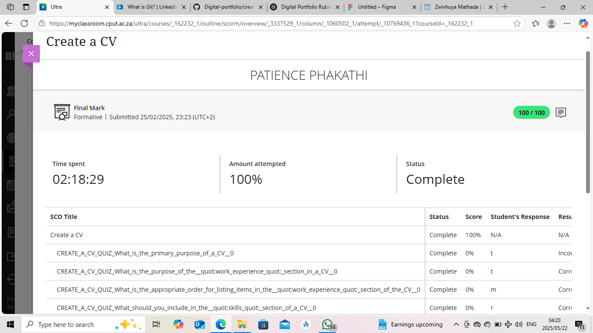

# Curriculum Vitae – Patience Phakathi
### 📌 Evidence

---

## Personal Information

**Full Name:** Patience Phakathi  
**Email:** [your-email@example.com]  
**Phone:** [your-phone-number]  
**Location:** [City, Province]  

---

## Career Objective

Motivated and dedicated ICT student with a passion for technology and continuous learning. Seeking opportunities to grow professionally and contribute meaningfully to the digital and development landscape.

---

## Education

**Diploma in Information and Communication Technology**  
Cape Peninsula University of Technology (CPUT)  
Expected Graduation: [Month, Year]

---

## Skills

- Programming: Java, Python, JavaScript
- Web Development: HTML, CSS, PHP
- Database Management: MySQL
- Tools: Git, GitHub, VS Code, Postman
- Soft Skills: Teamwork, Communication, Time Management

---

## Work Experience / Projects

**Student Project – Attendance Tracking App**  
- Built using Flutter (frontend) and Node.js (backend)
- Managed event and student data with MySQL
- Developed and tested REST APIs for event check-ins

**E-Commerce Backend (Academic Project)**  
- Designed domain models using Java and Spring Boot
- Implemented CRUD operations and JPA repositories
- Applied Domain-Driven Design principles

---

## Certifications (Optional)

- [Any short courses, workshops, or online certifications you completed]

---

## References

Available on request.
